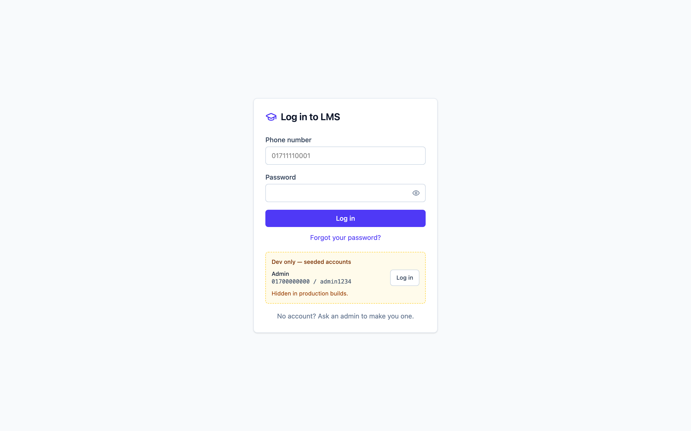
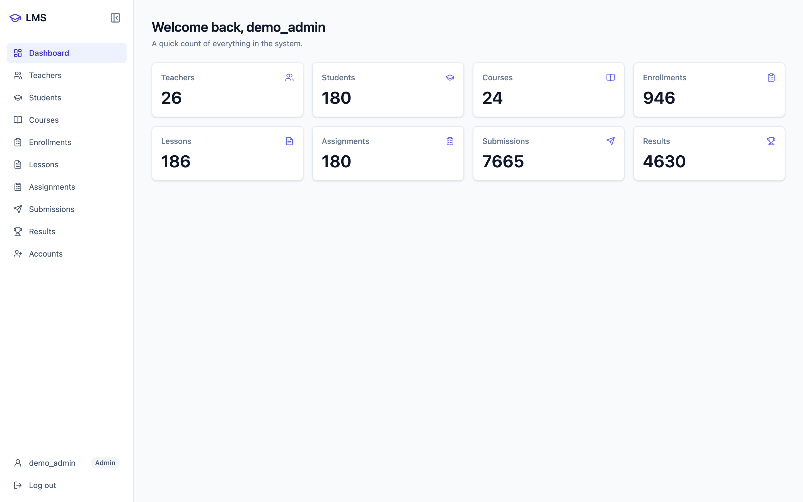
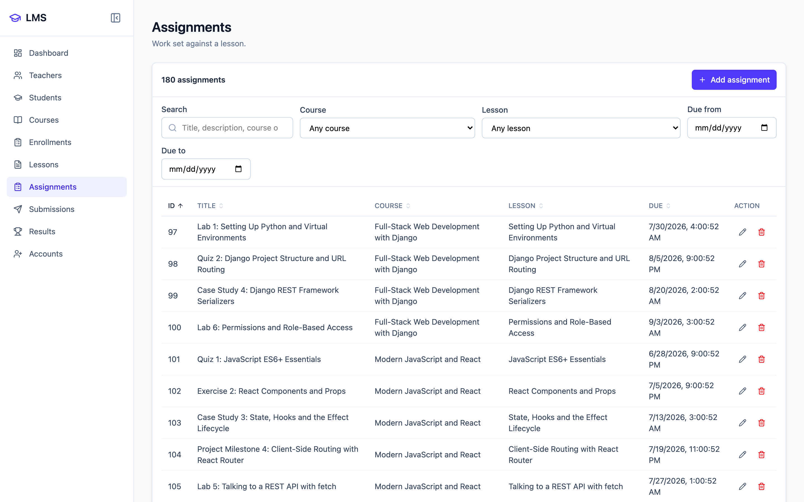
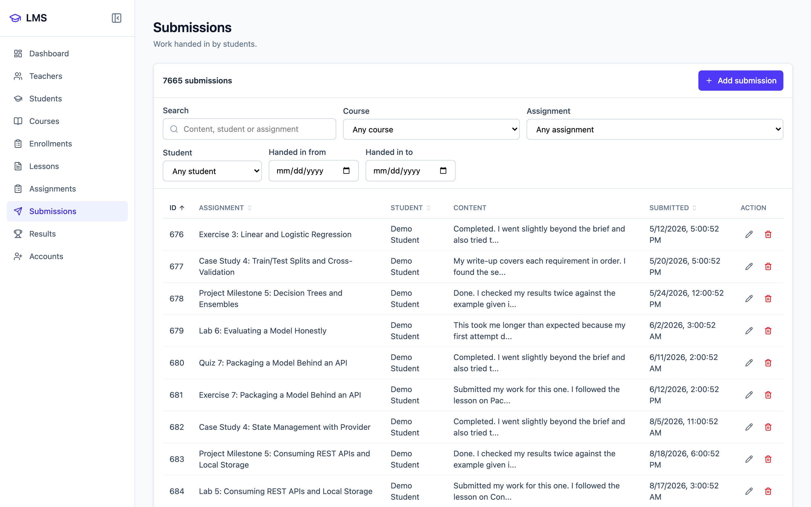
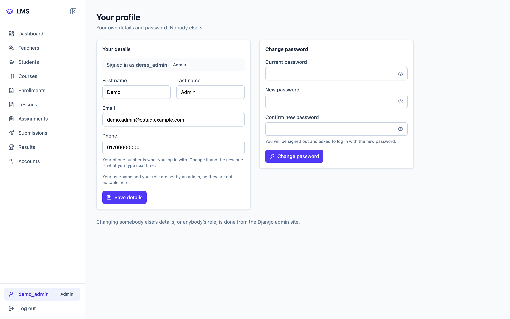

<div align="center">

# 🎓 NahinEdify

### Learning Management System

A full-stack LMS for managing courses, lessons, assignments, submissions, enrollments, and results.

<br>


<br>

**Django REST Framework + React + JWT**

</div>

---

## 📌 Overview

**NahinEdify** is a full-stack Learning Management System designed to manage academic activities through a role-based platform.

The system provides separate permissions and workflows for **Administrators, Teachers, and Students**, with a Django REST API powering a modern React frontend.

The project focuses on practical full-stack development, REST API design, authentication, authorization, CRUD operations, and responsive user interfaces.

---

## ✨ Features

* 🔐 JWT-based authentication
* 📱 Phone number login
* 👥 Role-based access control
* 👨‍💼 Admin, Teacher & Student roles
* 📚 Course management
* 📖 Lesson management
* 📝 Assignment management
* 📤 Assignment submission
* 📊 Grading & results
* 🎓 Course enrollment
* 🔎 Search & filtering
* 📧 Password reset through email
* 🛡️ Protected API endpoints
* 📱 Responsive frontend
* 🔗 RESTful API architecture

---

## 🛠️ Tech Stack

| Category            | Technologies                          |
| ------------------- | ------------------------------------- |
| **Backend**         | Python, Django, Django REST Framework |
| **Authentication**  | Simple JWT                            |
| **Frontend**        | React, JavaScript, Vite               |
| **Styling**         | Tailwind CSS                          |
| **Charts**          | Recharts                              |
| **Database**        | SQLite                                |
| **Version Control** | Git, GitHub                           |
| **Development**     | VS Code                               |

---

## 📸 Screenshots

### 🔐 Login

<p align="center">
  
</p>

### 📊 Dashboard

<p align="center">
  
</p>

### 📚 Courses

<p align="center">
  
</p>

### 📝 Assignments

<p align="center">
  
</p>

### 📤 Submissions & Results

<p align="center">
  
</p>

### 👤 Profile

<p align="center">
  
</p>

---

## 🏗️ Project Structure

```text
NahinEdify/
│
├── backend/
│   ├── backend/
│   ├── manage.py
│   ├── requirements.txt
│   └── .env
│
├── frontend/
│   ├── src/
│   ├── public/
│   ├── package.json
│   └── vite.config.js
│
├── docs/
│   └── screenshots/
│       ├── login.png
│       ├── dashboard.png
│       ├── courses.png
│       ├── assignments.png
│       ├── submissions.png
│       └── profile.png
│
└── README.md
```

---

## 🚀 Installation & Setup

### 1. Clone the Repository

```bash
git clone https://github.com/nahinsha/NahinEdify.git
cd NahinEdify
```

### 2. Backend Setup

```bash
cd backend
```

Create a virtual environment:

```bash
python -m venv venv
```

Activate it on Windows:

```bash
venv\Scripts\activate
```

Install dependencies:

```bash
pip install -r requirements.txt
```

### 3. Environment Variables

Create a `.env` file inside the `backend` directory:

```env
SECRET_KEY=your-secret-key
DEBUG=True
```

> ⚠️ Never commit the `.env` file to GitHub.

### 4. Database Migration

```bash
python manage.py makemigrations
python manage.py migrate
```

Create an admin account:

```bash
python manage.py createsuperuser
```

### 5. Start the Backend

```bash
python manage.py runserver
```

Backend API:

```text
http://127.0.0.1:8000/api/
```

### 6. Start the Frontend

Open another terminal:

```bash
cd frontend
npm install
npm run dev
```

Then open the URL provided by Vite in your browser.

---

## 👥 User Roles & Permissions

| Role        | Main Responsibilities                                            |
| ----------- | ---------------------------------------------------------------- |
| **Admin**   | Full system management                                           |
| **Teacher** | Manage courses, lessons, assignments, submissions & grading      |
| **Student** | Access courses, lessons, assignments, submit work & view results |

### Admin

* Manage users
* Manage courses
* Manage lessons
* Manage assignments
* Manage enrollments
* Manage submissions
* Manage grades

### Teacher

* Create and manage courses
* Manage lessons
* Create assignments
* View student submissions
* Grade assignments

### Student

* View courses
* Access lessons
* View assignments
* Submit assignments
* View grades and results

---

## 🔗 API Overview

NahinEdify provides RESTful APIs for the main LMS resources.

```text
/api/login/
/api/register/
/api/courses/
/api/lessons/
/api/assignments/
/api/submissions/
/api/grades/
/api/enrollments/
```

Protected endpoints require a valid JWT access token.

---

## 🔐 Authentication

NahinEdify uses **JSON Web Token (JWT)** authentication.

After a successful login, the API returns:

```text
Access Token
Refresh Token
```

The access token is used to access protected resources according to the authenticated user's role.

---

## 📁 Main Modules

The system is organized around the following core LMS resources:

* Users & Profiles
* Courses
* Enrollments
* Lessons
* Assignments
* Submissions
* Grades

Each resource is handled through the Django REST Framework API and connected to the React frontend.

---

## 🔗 GitHub Repository

<p align="center">

<a href="https://github.com/nahinsha/NahinEdify">
  
</a>

</p>

---

## 👨‍💻 Author

<div align="center">

### Nahin Shahariar

**Computer Science & Engineering**

<br>

<a href="https://github.com/nahinsha">
  
</a>
&nbsp;
<a href="https://linkedin.com/in/md-shahariar-nahin-a5b147301">
  
</a>
&nbsp;
<a href="https://shahariar-nahin-portfolio.vercel.app/">
  
</a>

</div>

---

<div align="center">

**Built with Django REST Framework and React.**

</div>
